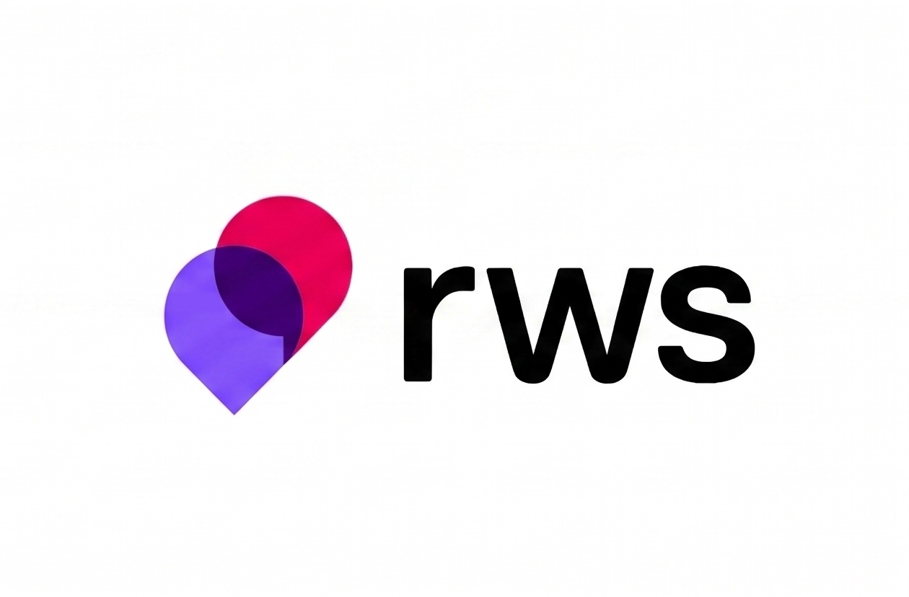
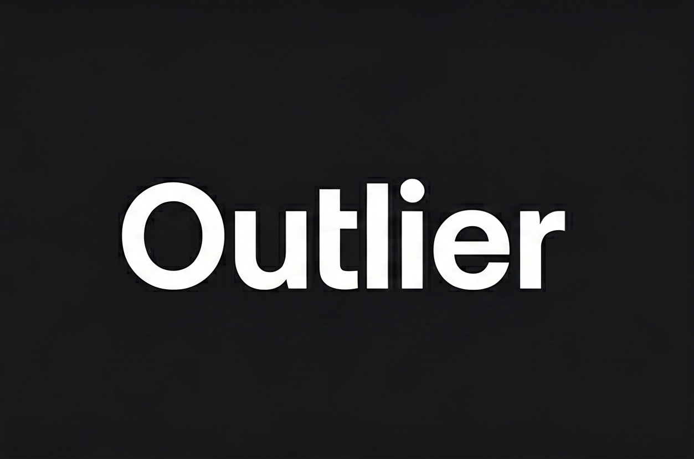
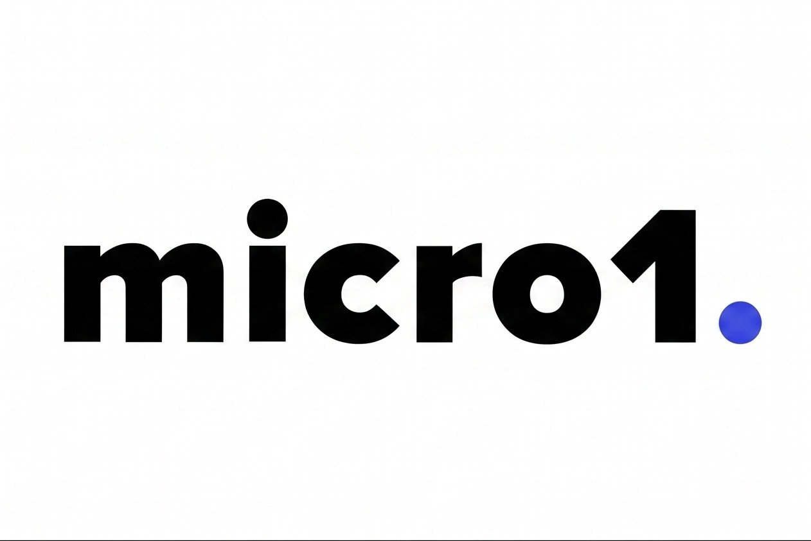

# Francella Rojas — Java Full Stack Developer | AI Evaluation & Quality Analyst

Professional with more than 17 years of corporate experience, including 6 years in Business Intelligence, data analytics, KPI management, and operational optimization. My profile combines business expertise, software development, and Artificial Intelligence. I currently contribute to AI evaluation and quality projects involving Large Language Models (LLMs) while continuing to strengthen my Full Stack development skills using Java, Spring Boot, SQL, TypeScript, and Angular.

Currently pursuing a Higher Vocational Diploma in Web Application Development (DAW) in Spain and maintaining a public portfolio focused on software development, Artificial Intelligence, automation, and data-driven business solutions.

### About Me

- Web Application Development (DAW) student in Spain.
- AI Evaluation & Quality Analyst contributing to Large Language Model (LLM) evaluation projects.
- Experience in Business Intelligence, data analytics, KPI management, and operational optimization.
- Full Stack application development using Java, Spring Boot, SQL, TypeScript, and Angular.
- Professional interest in Artificial Intelligence, data quality, automation, and enterprise software solutions.

### Technologies & Tools

#### Backend & Web Development

#### Data Analytics & Databases

#### Artificial Intelligence & LLMs

#### Development & Productivity Tools

#### AI Evaluation & Data Quality

| | | | |
|:---:|:---:|:---:|:---:|
|  |  |  |  |
| **RWS** | **Outlier** | **micro1** | **Turing** |
#### Concepts

- Desarrollo Backend: Java, Spring Boot, APIs REST, MVC
- Persistencia: JPA, Hibernate, Spring Data
- Bases de Datos: PostgreSQL, MySQL, MongoDB
- Inteligencia Artificial: LLM Evaluation, AI Quality Assessment, Prompt Engineering, Data Annotation
- IA Generativa: Large Language Models (LLMs), Reasoning Evaluation, Safety Assessment
- Reinforcement Learning from Human Feedback (RLHF)
- Analítica y BI: KPI Management, Power BI, Excel Analytics
- Intercambio de datos: JSON, XML, CSV
- Control de versiones: Git & GitHub
- Entornos de desarrollo: IntelliJ IDEA, VS Code

#### Specializations

- Backend Development: Java, Spring Boot, REST APIs, MVC
- Persistence: JPA, Hibernate, Spring Data
- Databases: PostgreSQL, MySQL, MongoDB
- Artificial Intelligence: LLM Evaluation, AI Quality Assessment, Prompt Engineering, Data Annotation
- Generative AI: Large Language Models (LLMs), Reasoning Evaluation, Safety Assessment
- Reinforcement Learning from Human Feedback (RLHF)
- Analytics & BI: KPI Management, Power BI, Excel Analytics
- Data Formats: JSON, XML, CSV
- Version Control: Git & GitHub
- IDEs: IntelliJ IDEA, VS Code

### Artificial Intelligence Experience

#### AI Evaluation Specialist & Quality Analyst — RWS Group

**Project: DIAMOND | ECHO 2026**

- Evaluate and annotate AI-generated content.
- Assess factual accuracy, reasoning quality, safety, and linguistic fluency.
- Apply detailed annotation guidelines for LLM training datasets.
- Perform multilingual evaluation and language quality assessment for Spanish content.
- Identify inconsistencies, ambiguities, and hallucinations in AI-generated responses.
- Contribute to Reinforcement Learning from Human Feedback (RLHF) workflows.
- Maintain high productivity and quality standards in remote AI operations.

### Featured Projects

#### dentify-desktop-mvc

Comprehensive desktop management system designed for dental clinics. Developed collaboratively using agile methodologies, Kanban practices, and GitHub Projects. Implements Java MVC architecture, MySQL persistence through DAO patterns, and business logic for appointment scheduling and validation.

#### bootcamp-remote

Advanced analytics portfolio covering the complete data lifecycle, including ETL pipelines with Pandas and SQLAlchemy, REST API consumption, relational modeling, Power BI integration, Excel dashboards, exploratory data analysis (EDA), and introductory predictive modeling using Scikit-Learn.

#### sql-star-schema-retail

Retail-focused analytics project demonstrating multidimensional modeling through Star Schema design, advanced SQL querying, and structured business metrics analysis.

#### Lumora (Work in Progress)

AI-powered business intelligence SaaS platform focused on KPI monitoring, process automation, and decision intelligence. Built using Java Spring Boot, PostgreSQL, Angular, and modern AI-driven technologies.
